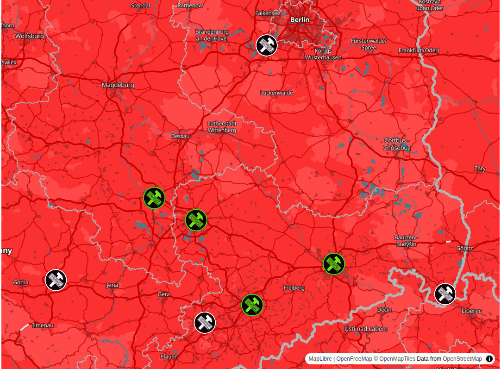

# Chaos Map

Chaosmap proxy for map.chaoszone.cz

## Install

- Check out the code, change into the directory

`git clone https://github.com/Eigenbaukombinat/chaos-zone-map.git && cd chaos-zone-map`

- Create a virtual environment 

`python3 -m venv`

- Install dependencies

`pip install -r requirements.txt`

## Start

- `bin/flask --app chaosmap run`